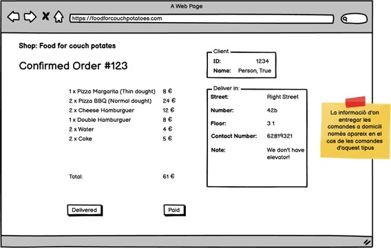
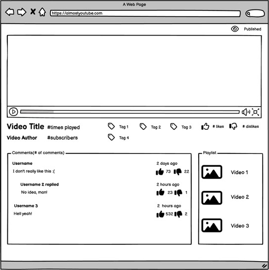

# MongoDb databases
<a href="https://github.com/SKRTEEEEEE">
<div align="center">
  
</div>
</a>

Actual ejercicio 2.3, antiguo ejercicio 5.3 del curso de [NodeJS](https://nodejs.org/en) de [ItAcademy](https://www.barcelonactiva.cat/es/itacademy).

## [Recursos](https://github.com/SKRTEEEEEE/markdowns/)
### Requerimientos
<details>
<summary><code>Enunciado ejercicios</code></summary>
<br/>

#### **Nivel 1:** 
- Una óptica, llamada “Cul d'Ampolla”, quiere informatizar la gestión de los clientes/as y ventas de gafas.

  1. En primer lugar, la óptica quiere saber cuál es el proveedor de cada una de las gafas. En concreto quiere saber de cada proveedor : El nombre, la dirección (calle, número, piso, puerta, ciudad, código postal y país), teléfono, fax, NIF.

  2. De las gafas se quiere saber: La marca, la graduación de cada vidrio, el tipo de montura (flotante, pasta o metálica), el color de la montura, el color de cada vidrio y el precio.

  3. De los clientes/as desea almacenar: El nombre, la dirección postal, el teléfono, el correo electrónico, la fecha de registro.
  4. Cuando llega un/a cliente/a nuevo, almacenar el/la cliente/a que le ha recomendado el establecimiento (siempre que alguien le haya recomendado).
  5. Nuestro sistema deberá indicar quién ha sido el empleado/a que ha vendido cada anteojo. Define qué día/hora se realiza la venta.
- Ejercicio 1, nivel 1.

  Imagina que tenemos la siguiente interfaz gráfica, desde el punto de vista de un cliente de la Óptica. ¿Cómo diseñarías la base de datos que facilitara la información?

  

- Ejercicio 2, nivel 1

  ¿Y si el punto de vista fuera de la interfaz fueran las gafas?

  

#### **Nivel 2:**
- Te han contratado para diseñar una web que permita realizar pedidos de comida a domicilio por Internet.

  _Ten en cuenta las siguientes indicaciones para modelar cómo sería la base de datos del proyecto:_

  1. Para cada cliente/a almacenamos un identificador único: Nombre, apellidos, dirección, código postal, localidad, provincia, número de teléfono.

  2. Una persona puede realizar muchos pedidos, pero un único pedido sólo puede ser realizado por una única persona. De cada pedido se almacena un identificador único: Fecha/hora de realización, si el pedido es para reparto a domicilio o para recoger en tienda, la cantidad de productos que se han seleccionado de cada tipo, el precio total además de una nota con información adicional.

  3. Un pedido puede constar de uno o varios productos.

  4. Los productos pueden ser pizzas, hamburguesas y bebidas. De cada producto se almacena un identificador único: Nombre, descripción, imagen, precio. En el caso de las pizzas existen varias categorías que pueden cambiar de nombre a lo largo del año.

  5. Un pedido es gestionado por una única tienda y una tienda puede manejar muchos pedidos. De cada tienda se almacena un identificador único: Dirección, código postal, localidad, provincia.

  6. En una tienda pueden trabajar muchos empleados y un empleado sólo puede trabajar en una tienda. De cada empleado/a, se almacena un identificador único: Nombre, apellidos, NIF, Teléfono, si trabaja como cocinero/ao repartidor/a. Para los pedidos de reparto a domicilio interesa guardar quién es el repartidor/a que hace la entrega del pedido y la fecha/hora del momento de la entrega.

  

#### **Nivel 3:**
- Trataremos de hacer un modelo sencillo de cómo sería la base de datos para una versión reducida de YouTube.

  1. De cada usuario/a guardamos un identificador único: Email, password, nombre de usuario/a, fecha de nacimiento, sexo, país, código postal.

  2. Un usuario/a publica vídeos. De cada vídeo guardamos un identificador único: Un título, una descripción, un tamaño, el nombre del archivo de vídeo, duración del vídeo, un thumbnail, el número de reproducciones, el número de likes, el número de dislikes.

  3. Un vídeo puede tener tres estados distintos: público, oculto y privado. Un vídeo puede tener muchas etiquetas. Interesa guardar quién es el usuario/a que publica el vídeo y en qué fecha/hora lo hace.

  4. Un usuario puede crear un canal. Un canal tiene un identificador único: Un nombre, una descripción, una fecha de creación.

  5. Un usuario/a puede suscribirse a los canales de otros usuarios/as. Un usuario puede darle un like o un dislike a un vídeo una única vez. Habrá que llevar un registro de los usuarios/as que le han dado like y dislike a un determinado vídeo y en qué fecha/hora lo hicieron.

  6. Un usuario puede crear playlists con los vídeos que le gustan. Cada playlist tiene un identificador único: un nombre, una fecha de creación, un estado que indica que puede ser pública o privada.

  7. Un usuario puede escribir comentarios en un vídeo determinado. Cada comentario está identificado por un identificador único: El texto del comentario, la fecha/hora en la que se realizó.

  

</details>

### Proceso
<details><summary><code>Configurar mongodb en la maquina </code></summary></br>

**_Para windows_**
##### Descargar y instalar [MongoDB Community Server](https://www.mongodb.com/try/download/community)
- _Si no tenemos MongoDB Community Server_
- Accedemos a la version actual de la comunidad de MongoDb Server, podemos encontrar-la en [esta pagina](https://www.mongodb.com/try/download/community).
- Configuramos la version para el tipo de arquitectura que utilize nuestro PC(x64/x32) y hacemos click a descargar. 
- Una vez descargada, instalaremos con la configuración por defecto(todo aceptar/continuar)
##### Conectar red local
- _Si no tenemos una red conectada a MongoDb Community Server_
- Una vez instalado, podemos abrir MongoDBCompass
- Una vez abierto, podemos hacer click en la opción de nuevo conexión. En las opciones, dejaremos el URI por defecto, `mongodb://localhost:27017`. En nombre podremos Local` y en color pondremos el que deseemos, se recomienda verde.

</details>

<details><summary><code><bold>Nivel 1</bold> </code></summary></br>

- _En este caso vamos a realizar las bases de datos con la inferencia de MongoDb y utilizando su shell._
##### Crear bases de datos y colecciones
- Creamos la base de datos con el siguiente comando:
  ```js
  use culDAmpolla
  ```
- Creamos la colección para los proveedores
  ```js
  db.proveedores.insertOne({
  nombre: "Grefusa",
  direccion: {
    calle: "Calle Dolores",
    numero: NumberInt(123),
    piso: NumberInt(1),
    puerta: "A",
    ciudad: "Barcelona",
    codigo_postal: "08198",
    pais: "Catalunya"
  },
  telefono: "+34-123456789",
  fax: "+34-987654321",
  nif: "NIF123456"
  })
  ```
- Creamos la colección para las monturas
  ```js
  db.gafas.insertOne({
    marca: "Guess",
    graduacion: {
      vidrio1: "+1.5",
      vidrio2: "+1"
    },
    tipo_montura: "Pasta",
    color_montura: "Verde",
    color_vidrio: {
      vidrio1: "Rojo",
      vidrio2: "Verde"
    },
    precio: 100.00
  });
  ```
- Creamos la colección para los clientes
  ```js
  //Cliente sin recomendación
  db.clientes.insertOne({
  nombre: "Aitor Tilla",
  direccion_postal: {
    calle: "Calle Buenavista",
    numero: NumberInt(26),
    piso: NumberInt(17),
    puerta: "B",
    ciudad: "Zaragosa",
    codigo_postal: "54321",
    pais: "España"
  },
  telefono: "+34-987654321",
  correo_electronico: "cocinitas.tortilla@gmail.com",
  fecha_registro: new Date()
  });
  //Cliente con recomendación
  db.clientes.insertOne({
  nombre: "Rosa Melano",
  direccion_postal: {
    calle: "Calle Delicias",
    numero: NumberInt(126),
    piso: NumberInt(7),
    puerta: "1",
    ciudad: "Barcelona",
    codigo_postal: "09182",
    pais: "España"
  },
  telefono: "+34-987654321",
  correo_electronico: "cocinitas.tortilla@gmail.com",
  fecha_registro: new Date(),
	recomendado: ObjectId('66ed96e404f9e9428482e6a6')
  });
  ```
- Creamos la colección para las ventas
  ```js
  db.ventas.insertMany([
    {
  cliente_id: ObjectId("66ed96e404f9e9428482e6a6"), 
  gafas_id: ObjectId('66ed94d804f9e9428482e6a5'), 
  empleado: "El pepe",
  fecha_hora: new Date()
  },{
  cliente_id: ObjectId("66ed97d904f9e9428482e6a7"), 
  gafas_id: ObjectId('66ed94d804f9e9428482e6a5'), 
  empleado: "El pepe",
  fecha_hora: new Date()
  }]);
  ```
##### Añadir "indexation"
- **"Indexation" para el ejercicio 1 del nivel 1:**
  ```js
  db.clientes.createIndex({
  "direccion_postal.ciudad": 1,
  telefono: 1,
  correo_electronico: 1,
  fecha_registro: -1
  });
  ```
- **"Indexation" para el ejercicio 2 del nivel 1:**
  - _Se ignora el campo proveedores en la búsqueda de gafas ya que no era requerimiento para la bdd_
  ```js
  //Indice búsqueda gafas
  db.gafas.createIndex({
  marca: 1,
  tipo_montura: 1,
  precio: 1
  });
  //Indice búsqueda proveedores
  db.proveedores.createIndex({
  nombre: 1
  });
  //Indice búsqueda clientes
  db.clientes.createIndex({
  nombre: 1
  });
  ```

</details>

<details><summary><code><bold>Nivel 2</bold> </code></summary><br/>

- _En este caso vamos a utilizar el método validador de MongoDb y la shell_
##### Creación bases de datos y colecciones
- Creamos la base de datos con el siguiente comando:
  ```js
  use foodDeliDB
  ```
- Creamos la colección para los clientes:
  ```js
  db.createCollection("clientes", {
   validator: {
      $jsonSchema: {
         bsonType: "object",
         required: ["nombre", "apellidos", "direccion", "codigoPostal", "localidad", "provincia", "telefono"],
         properties: {
            nombre: {
                bsonType: "string",
                pattern: "^.{3,}$",
                description: "Debe ser una cadena de más de tres caracteres y es requerido"
            },
            apellidos: {
               bsonType: "string",
               pattern: "^.{3,}$",
              description: "Debe ser una cadena de más de tres caracteres y es requerido"
            },
            direccion: {
               bsonType: "string",
               description: "Debe ser una cadena y es requerido"
            },
            codigoPostal: {
               bsonType: "string",
               pattern: "^[0-9]{5}$",
               description: "Debe ser una cadena de 5 dígitos y es requerido"
            },
            localidad: {
               bsonType: "string",
               description: "Debe ser una cadena y es requerido"
            },
            provincia: {
               bsonType: "string",
               description: "Debe ser una cadena y es requerido"
            },
            telefono: {
               bsonType: "string",
               pattern: "^[0-9]{9}$",
               description: "Debe ser una cadena de 9 dígitos y es requerido"
            },
            email: {
               bsonType: "string",
               pattern: "^[a-zA-Z0-9._%+-]+@[a-zA-Z0-9.-]+.[a-zA-Z]{2,}$",
               description: "Debe ser una dirección de correo electrónico válida"
            },
            fechaRegistro: {
               bsonType: "date",
               description: "Debe ser una fecha válida"
            }
         }
      }
   }
  })
  ```

  <details><summary>Tests y población <code>clientes</code></summary>

  ##### Inserciones erróneas
  ```js
  //Inserción errónea por validación
  db.clientes.insertOne({
      "nombre": "Ana",                      // Correcto
      "apellidos": "Pérez",                 // Correcto
      "direccion": "Calle Falsa 123",      // Correcto
      "codigoPostal": "1234",               // Incorrecto: debe ser una cadena de 5 dígitos
      "localidad": "Madrid",                // Correcto
      "provincia": "Madrid",                // Correcto
      "telefono": "12345678",               // Incorrecto: debe ser una cadena de 9 dígitos
      "email": "ana.perez@ejemplo.com",     // Correcto
      "fechaRegistro": "2024-09-20T12:00:00Z" // Correcto
  })
  // insertMany(), algunos con errores otros correctos
  db.clientes.insertMany([
    {
        "nombre": "Ana",
        "apellidos": "Pérez",
        "direccion": "Calle Gran Vía 12",
        "codigoPostal": "28013",              // Correcto
        "localidad": "Madrid",
        "provincia": "Madrid",
        "telefono": "612345678",              // Correcto
        "email": "ana.perez@ejemplo.com",
        "fechaRegistro": new Date("2024-09-20T12:00:00Z")
    },
    {
        "nombre": "Luis",
        "apellidos": "García",
        "direccion": "Avenida de la Paz 45",
        "codigoPostal": "28002",              // Correcto
        "localidad": "Madrid",
        "provincia": "Madrid",
        "telefono": "123456789",              // Incorrecto: debe ser una cadena de 9 dígitos
        "email": "luis.garcia@ejemplo.com",
        "fechaRegistro": new Date("2024-09-20T12:00:00Z")
    },
    {
        "nombre": "María",
        "apellidos": "López",
        "direccion": "Calle de Vallehermoso 99",
        "codigoPostal": "28015",              // Correcto
        "localidad": "Madrid",
        "provincia": "Madrid",
        "telefono": "98765432",               // Incorrecto: debe ser una cadena de 9 dígitos
        "email": "maria.lopez@ejemplo.com",
        "fechaRegistro": new Date("2024-09-20T12:00:00Z")
    },
    {
        "nombre": "Carlos",
        "apellidos": "Martínez",
        "direccion": "Calle del Arenal 5",
        "codigoPostal": "28001",              // Correcto
        "localidad": "Madrid",
        "provincia": "Madrid",
        "telefono": "612345678",              // Correcto
        "email": "carlos.martinez@ejemplo.com",
        "fechaRegistro": new Date("2024-09-20T12:00:00Z")
    },
    {
        "nombre": "Sofía",
        "apellidos": "Hernández",
        "direccion": "Calle de Serrano 88",
        "codigoPostal": "28006",              // Correcto
        "localidad": "Madrid",
        "provincia": "Madrid",
        "telefono": "1234567",                // Incorrecto: debe ser una cadena de 9 dígitos
        "email": "sofia.hernandez@ejemplo.com",
        "fechaRegistro": new Date("2024-09-20T12:00:00Z")
    }
  ])
  ```
  ##### Inserciones correctas
  ```js
  //Inserción simple
  db.clientes.insertOne({
  nombre: "María",
  apellidos: "González López",
  direccion: "Calle Mayor 123, 2º Izquierda",
  codigoPostal: "28001",
  localidad: "Madrid",
  provincia: "Madrid",
  telefono: "912345678",
  email: "maria.gonzalez@email.com",
  fechaRegistro: new Date()
  })
  //Inserción múltiple
  db.clientes.insertMany([
  {
    nombre: "Juan",
    apellidos: "Pérez Martínez",
    direccion: "Avenida de la Constitución 45",
    codigoPostal: "41001",
    localidad: "Sevilla",
    provincia: "Sevilla",
    telefono: "954123456",
    email: "juan.perez@email.com",
    fechaRegistro: new Date()
  },
  {
    nombre: "Anna",
    apellidos: "López García",
    direccion: "Calle Gran Vía 67, 3º Derecha",
    codigoPostal: "08001",
    localidad: "Barcelona",
    provincia: "Barcelona",
    telefono: "934567890",
    email: "ana.lopez@email.com",
    fechaRegistro: new Date()
  },
  {
    nombre: "Carlos",
    apellidos: "Fernández Rodríguez",
    direccion: "Calle Portales 23",
    codigoPostal: "26001",
    localidad: "Logroño",
    provincia: "La Rioja",
    telefono: "941234567",
    email: "carlos.fernandez@email.com",
    fechaRegistro: new Date()
  }
  ])
  ```
  </details>
- Creamos la colección para los pedidos:
  ```js
  db.createCollection("pedidos", {
   validator: {
      $jsonSchema: {
         bsonType: "object",
         required: ["idCliente","idTienda", "entrega", "productos", "precioTotal", "timestamp"],
         properties: {
            idCliente: {
              bsonType: "objectId",
              description: "Debe ser un ObjectId valido y es requerido"
            },
            idTienda:{
              bsonType: "objectId",
              description: "Debe ser un ObjectId valido y es requerido"
            },
            entrega: {
               bsonType: "object",
               required: ["tipo"],
               properties: {
                tipo: {
                  enum: ["recoger", "domicilio"],
                  description: "Debe ser 'domicilio' o 'recoger' y es requerido"
                },
                repartidorId: {
                  bsonType: "objectId",
                  description: "Dene ser un ObjectId valido"
                },
                fechaEntrega: {
                  bsonType: "date",
                  description: "Debe ser una fecha y hora válida"

                }
               },
               description: "Debe incluir el tipo 'domicilio' o 'recoger'"
            },
            productos: {
               bsonType: "array",
               minItems: 1,
               items: {
                  bsonType: "object",
                  required: ["productoId", "cantidad", "precio"],
                  properties: {
                     productoId: {
                        bsonType: "objectId",
                        description: "Debe ser un ObjectId válido y es requerido"
                     },
                     cantidad: {
                        bsonType: "int",
                        minimum: 1,
                        description: "Debe ser un entero mayor que 0 y es requerido"
                     },
                     precio: {
                        bsonType: "double",
                        minimum: 0,
                        description: "Debe ser un número decimal no negativo y es requerido"
                     }
                  }
               },
               description: "Debe ser un array de al menos un producto y es requerido"
            },
            precioTotal: {
               bsonType: "double",
               minimum: 0,
               description: "Debe ser un número decimal no negativo y es requerido"
            },
            notaAdicional: {
               bsonType: "string",
               description: "Debe ser una cadena si está presente"
            },
            timestamp: {
               bsonType: "date",
               description: "Debe ser la fecha y hora de creación del pedido"
            }
         }
      }
   }
  })
  ```

   <details><summary>Población <code>pedidos</code></summary>

  ##### Inserciones correctas
  ```js
  db.pedidos.insertMany([
  {
    idCliente: ObjectId('66edc2b604f9e9428482e6c4'),
    idTienda: ObjectId('66edd37a04f9e9428482e6d1'),
    entrega: {
      tipo: "domicilio",
      repartidorId: ObjectId('66edd8e604f9e9428482e6d4'),
      fechaEntrega: new Date("2024-09-20T14:30:00Z")
    },
    productos: [
      {
        productoId: ObjectId('66edd06604f9e9428482e6c9'),
        cantidad: 2,
        precio: 8.5
      },
      {
        productoId: ObjectId('66edd0af04f9e9428482e6cc'),
        cantidad: 1,
        precio: 6.99
      }
    ],
    precioTotal: 23.99,
    notaAdicional: "Entregar por la puerta trasera.",
    timestamp: new Date()
  },
  {
    idCliente: ObjectId('66edc2b604f9e9428482e6c5'),
    idTienda: ObjectId('66edd37a04f9e9428482e6d0'),
    entrega: {
      tipo: "recoger",
      fechaEntrega: new Date("2024-09-20T15:00:00Z")
    },
    productos: [
      {
        productoId: ObjectId('66edd0af04f9e9428482e6cd'),
        cantidad: 3,
        precio: 1.5
      }
    ],
    precioTotal: 4.5,
    timestamp: new Date()
  }
  ]);
  ```

  </details>
- Creamos la colección para los productos:
  ```js
  db.createCollection("productos", {
  validator: {
    $jsonSchema: {
      bsonType: "object",
      required: ["nombre", "descripcion", "imagen", "precio", "categoria"],
      properties: {  
        nombre: {
          bsonType: "string",
          description: "Debe ser una cadena de texto y es requerido"
        },
        descripcion: {
          bsonType: "string",
          description: "Debe ser una cadena de texto y es requerido"
        },
        imagen: {
          bsonType: "string",
          pattern: "^(http|https)://",
          description: "Debe ser una URL válida que comience con http o https"
        },
        precio: {
          bsonType: "double",
          minimum: 0,
          description: "Debe ser un número decimal no negativo y es requerido"
        },
        categoria: {
          enum: ["pizza", "hamburguesa", "bebida"],
          description: "Debe ser 'pizza', 'hamburguesa' o 'bebida' y es requerido"
        },
        categoriasPizza: {
          bsonType: "array",
          items: {
            bsonType: "string"
          },
          description: "Especifica las categorías de pizza (si aplica). Solo para productos de la categoría 'pizza'"
        }
      }
    }
  }
  });
  ```

  <details><summary>Tests y población <code>productos</code></summary>

  ##### Inserciones erróneas
  ```js
  //Inserción errónea por validación
  db.productos.insertOne({
    nombre: "Pizza Cuatro Quesos",
    descripcion: "Pizza con mezcla de cuatro quesos italianos",
    imagen: "https://ejemplo.com/pizza_cuatro_quesos.jpg",
    precio: -5.50,  // Precio negativo, no válido
    categoria: "pizza",
    categoriasPizza: ["quesos", "especial"]
  });

  // insertMany(), algunos con errores otros correctos
  db.productos.insertMany([
    {
      nombre: "Hamburguesa Vegetal",
      descripcion: "Hamburguesa a base de plantas",
      imagen: "ftp://ejemplo.com/hamburguesa_vegetal.jpg",  // URL inválida (debe comenzar con http o https)
      precio: 7.99,
      categoria: "hamburguesa"
    },
    {
      nombre: "Pizza Especial",
      descripcion: "Pizza con ingredientes especiales",
      imagen: "https://ejemplo.com/pizza_especial.jpg",
      precio: 12.99,
      categoria: "ensalada"  // Categoría no válida (debe ser pizza, hamburguesa o bebida)
    }
  ]);
  ```
  ##### Inserciones correctas
  ```js
  //Inserción simple
  db.productos.insertOne({
    nombre: "Pizza Margarita",
    descripcion: "Pizza clásica con tomate y mozzarella",
    imagen: "https://ejemplo.com/pizza_margarita.jpg",
    precio: 8.50,
    categoria: "pizza",
    categoriasPizza: ["clásica", "vegetariana"]
  });

  //Inserción múltiple
  db.productos.insertMany([
    {
      nombre: "Hamburguesa Clásica",
      descripcion: "Hamburguesa con lechuga, tomate y queso",
      imagen: "https://ejemplo.com/hamburguesa_clasica.jpg",
      precio: 6.99,
      categoria: "hamburguesa"
    },
    {
      nombre: "Coca Cola",
      descripcion: "Bebida gaseosa de cola",
      imagen: "https://ejemplo.com/coca_cola.jpg",
      precio: 1.50,
      categoria: "bebida"
    }
  ]);

  ```
  </details>

- Creamos la colección para las tiendas:
  ```js
  db.createCollection("tiendas", {
  validator: {
    $jsonSchema: {
      bsonType: "object",
      required: ["direccion", "codigoPostal", "localidad", "provincia"],
      properties: {
        direccion: {
          bsonType: "string",
          description: "Debe ser una cadena de texto y es requerida"
        },
        codigoPostal: {
          bsonType: "string",
          pattern: "^[0-9]{5}$",
          description: "Debe ser un código postal válido de 5 dígitos y es requerido"
        },
        localidad: {
          bsonType: "string",
          description: "Debe ser una cadena de texto y es requerida"
        },
        provincia: {
          bsonType: "string",
          description: "Debe ser una cadena de texto y es requerida"
        }
      }
    }
  }
  });
  ```
  
  <details><summary>Tests y población <code>tiendas</code></summary>

  ##### Inserciones erróneas
  ```js
  //Inserción errónea por validación
    db.tiendas.insertOne({
    direccion: 999, // Debe ser string
    codigoPostal: "1234",  // Código postal inválido (debe tener 5 dígitos)
    localidad: "Barcelona",
    provincia: "Barcelona"
  });
  // insertMany(), algunos con errores otros correctos
  db.tiendas.insertMany([
  {
    direccion: "Calle del Carmen 222",
    codigoPostal: "29001",
    localidad: "Málaga",
    provincia: "Málaga"
  },
  {
    // Falta la dirección, lo que provocará que falle
    codigoPostal: "08001",
    localidad: "Barcelona",
    provincia: "Barcelona"
  }
  ]);
  ```

  ##### Inserciones correctas

  ```js
  //Inserción simple
  db.tiendas.insertOne({
    direccion: "Calle Falsa 123",
    codigoPostal: "28001",
    localidad: "Madrid",
    provincia: "Madrid"
  });

  //Inserción múltiple
  db.tiendas.insertMany([
    {
      direccion: "Avenida de la Constitución 456",
      codigoPostal: "41001",
      localidad: "Sevilla",
      provincia: "Sevilla"
    },
    {
      direccion: "Plaza Mayor 789",
      codigoPostal: "46001",
      localidad: "Valencia",
      provincia: "Valencia"
    }
  ]);

  ```
  </details>

- Creamos la colección para los empleados:
  ```js
  db.createCollection("empleados", {
  validator: {
    $jsonSchema: {
      bsonType: "object",
      required: ["nombre", "apellidos", "NIF", "telefono", "rol", "idTienda"],
      properties: {
        nombre: {
          bsonType: "string",
          description: "Debe ser una cadena de texto y es requerido"
        },
        apellidos: {
          bsonType: "string",
          description: "Debe ser una cadena de texto y es requerido"
        },
        NIF: {
          bsonType: "string",
          pattern: "^[0-9]{8}[A-Z]$",
          description: "Debe ser un NIF válido y es requerido"
        },
        telefono: {
          bsonType: "string",
          pattern: "^[0-9]{9}$",
          description: "Debe ser un número de teléfono válido de 9 dígitos y es requerido"
        },
        rol: {
          enum: ["cocinero", "repartidor"],
          description: "Debe ser 'cocinero' o 'repartidor' y es requerido"
        },
        idTienda: {
          bsonType: "objectId",
          description: "Debe ser un ObjectId válido que referencia una tienda y es requerido"
        }
      }
    }
  }
  });
  ```
 
  <details><summary>Tests y población <code>empleados</code></summary>

  ##### Inserciones erróneas
  ```js
  //Inserción errónea por validación
  db.empleados.insertOne({
    nombre: "Ana",
    apellidos: "Martínez",
    NIF: "1234567X", // NIF inválido (debe tener 8 dígitos y una letra)
    telefono: "12345678", // Teléfono inválido (debe tener 9 dígitos)
    rol: "chef", // Rol inválido (debe ser 'cocinero' o 'repartidor')
    idTienda: ObjectId('66edd37a04f9e9428482e6d1')
  });

  // insertMany(), algunos con errores otros correctos
  db.empleados.insertMany([
  {
    nombre: "Luis",
    apellidos: "Sánchez",
    NIF: "23456789B",
    telefono: "12345", // Teléfono inválido (debe tener 9 dígitos)
    rol: "repartidor",
    idTienda: ObjectId('66edd37a04f9e9428482e6d0')
  },
  {
    nombre: "Laura",
    apellidos: "Fernández",
    NIF: "34567890C",
    telefono: "612345678",
    rol: "cocinero",
    // Falta idTienda (es requerido)
  }
  ]);

  ```

  ##### Inserciones correctas

  ```js
  //Inserción simple
  db.empleados.insertOne({
    nombre: "Juan",
    apellidos: "Pérez",
    NIF: "12345678A",
    telefono: "612345678",
    rol: "cocinero",
    idTienda: ObjectId('66edd37a04f9e9428482e6d1')
  });


  //Inserción múltiple
  db.empleados.insertMany([
    {
      nombre: "María",
      apellidos: "Gómez",
      NIF: "23456789B",
      telefono: "623456789",
      rol: "repartidor",
      idTienda: ObjectId('66edd37a04f9e9428482e6d0')
    },
    {
      nombre: "Pedro",
      apellidos: "López",
      NIF: "34567890C",
      telefono: "634567890",
      rol: "cocinero",
      idTienda: ObjectId('66edd33b04f9e9428482e6cf')
    }
  ]);
  ```
  </details>

</details>

<details><summary><code><bold>Nivel 3</bold> </code></summary><br/>

- _En este caso se utiliza un script de ts, junto a mongoose, para crear y poblar la base de datos_
##### Proceso elaboración
- _**No necesario una vez clonado!**_
1. Crear tipos bdd. Podemos [ver el archivo de tipos, haciendo click aquí](./src/types.d.ts)
2. Crear esquemas bdd utilizando mongoose. Podemos [ver el archivo de esquemas, haciendo click aquí](./src/schemas.ts)
3. Crear función para obtener conexión a nuestro entorno. Podemos [ver el archivo con la función de conexión, haciendo click aquí](./src/lib.ts)
4. Crear función principal encargada de ejecutar la conexión, crear y poblar la base de datos. Podemos ver [el archivo script de creación y población de la bdd, haciendo click aquí!](./src/initDb-script.ts)
##### Instalación dependencias
- Para instalar las dependencias, usar el siguiente comando:
```bash
npm i
```
##### Ejecutar script
- Ejecutar script para crear y poblar las bases de datos
```
npx ts-node src/initDb-script.ts
```

</details>


<details><summary><code><bold>Extracción bdd y diagramas</bold> </code></summary><br/>

##### Descargar y configurar/instalar [MongoDB Command Line Database Tools](https://www.mongodb.com/try/download/database-tools)
- _Si no tenemos MongoDB Command Line Database Tools_
- Descargar la version actual de MongoDB Command Line Database Tools, encuentra-la en [esta pagina](https://www.mongodb.com/try/download/database-tools).
- Descargar la version para el tipo de arquitectura que utilize nuestro PC(x64/x32). 
- Descomprimir el archivo descargado, en la carpeta deseada, se recomienda en `C:\Program Files\MongoDB`. Se recomienda cambiar el nombre a la carpeta a `Tools`.
##### Exportar colecciones usando `mongoexport`
- Abrir PowerShell con permisos de administrador: Buscar PowerShell, hacer click con el botón derecho y hacer click en la opción `Ejecutar como Administrador`.
- Navegar a la carpeta, utilizando el siguiente comando:
  ```powershell
  cd "C:\Program Files\MongoDB\Tools\bin"
  ```
- Una vez ubicado en la carpeta, proceder a la extracción de nuestro documento de la bdd en formato json, para ello utiliza este comando base:
  ```PowerShell
  .\mongoexport.exe --db <nombre-bdd> --collection <nombre-collection> --out <ruta-carpeta>/<archivo-salida>.json --jsonArray
  ```

  - En este caso, para la colección de usuarios de la base de datos, puedes utilizar este, pero **recuerda** sustituir con el nombre de tu usuario de Pc en el campo `<tu-usuario>`:
    ```PowerShell
    .\mongoexport.exe --db culDAmpolla --collection clientes --out "C:/Users/<tu-usuario>/Documents/culdamp.clientes.json" --jsonArray

    ```

  - Una vez lanzado el comando, debe aparecer este mensaje en la terminal:
    ```PowerShell
    2024-09-21T16:38:13.539+0200    connected to: mongodb://localhost/
    2024-09-21T16:38:13.575+0200    exported 2 records
    ```
- En este punto, en la carpeta de documentos podrás visualizar la colección creada.

</details>

## Contacto

### Agradecimientos
#### [🏫 Institución: ItAcademy](https://www.barcelonactiva.cat/es/itacademy)
#### [🧑‍🏫 Docente: Francisco](https://frivero.com.ar/)

### Información de Contacto
#### [Web del desarrollador](profile-skrt.vercel.app)
#### [Envíame un mensaje](mailto:adanreh.m@gmail.com)

### Contribuciones y Problemas

Si encuentras problemas o deseas contribuir al proyecto, por favor, crea un issue en el repositorio.

